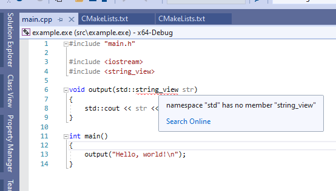

# Visual Studio 2019 16.2.5 string\_view issue

Issue: `namespace "std" has no member "string_view"`

This repo is a simple demonstration of an issue with Visual Studio 2019 16.2.5
intellisense failing to recognize `std::string_view` when running on a simple
CMake project.

See:

- [visualstudio.info.txt](visualstudio.info.txt) for visual studio instance version,
- [screenshot.png](screenshot.png) for visual demonstration of issue.

# Reproducing

. Clone the repos: git clone https://github.com/kfsone/vs-2019-stringview
. Open Visual Studio 2019 16.2.5 Community pointed to the above folder
. Wait for the CMake cache to generate
. Build All
. Start without Debugging to verify you see "Hello, world!"
. Close Visual Studio
. *Re-open visual studio and re-select the project*
. Open main.cpp
. Wait for intellisense to finish reloading
** Note `void output(std::string_view str)` has red-squiggles under `string_view`

